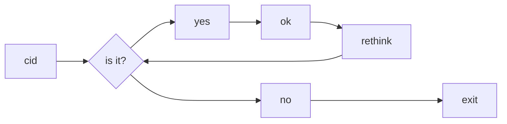
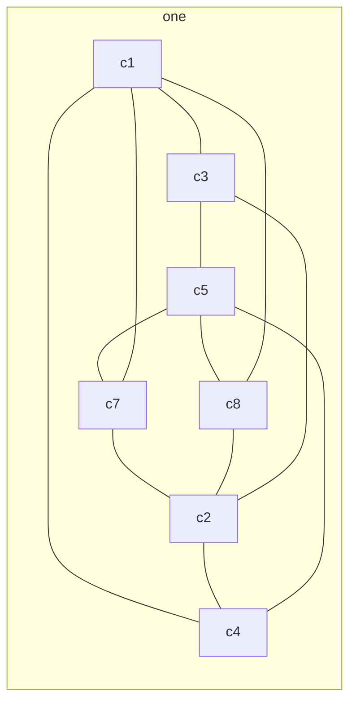

# Data processing

### repo with different data processing experiments, different ETL implementation, etc.

  - ETL: what is faster - read large file with pandas or create pythonic generator and parse rows one by one
  - ETL: try to implement ETL pipeline with different tools and compare results
  - tz_opendata_ua: split input files into smaller peaces according to nature of data
  - postgres: create postgreSQL database and store all processed data in database (db diagram - [link](https://dbdiagram.io/d/60ecb9434ed9be1c05c96be8))
  - as an option - create some web-interface with visualized data and maybe some statistics







``````
